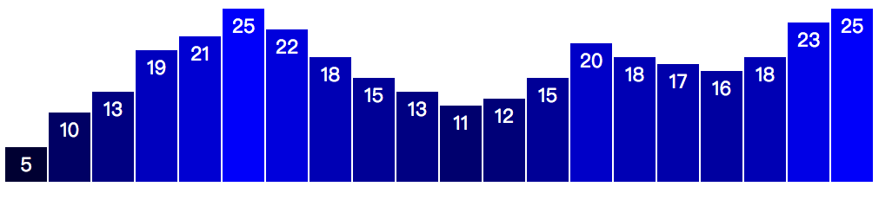
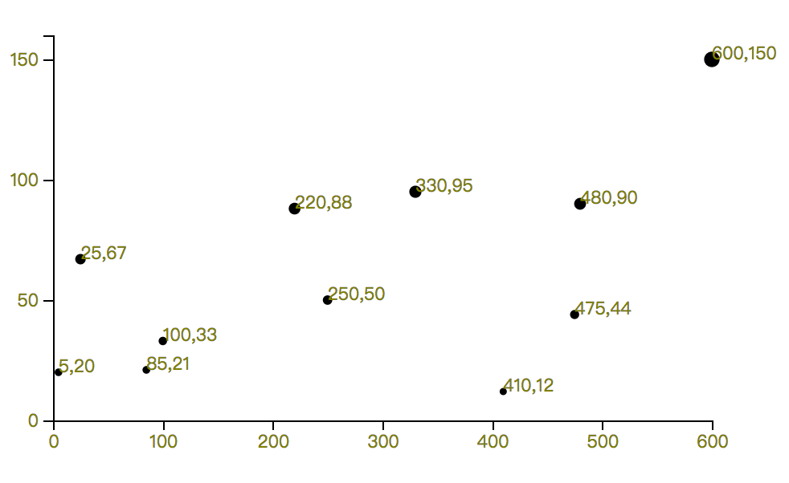

今天想說用 Go.js 寫視覺化，但卻有水印。雖然 D3.js 沒辦法在文章中寫入，但寫成普通網頁卻很簡單，而且文章也很多，所以就用 D3.js 。

<!-- more -->

```html
<!DOCTYPE html>
<html lang="en">
<head>
  <meta charset="UTF-8">
  <meta name="viewport" content="width=device-width, initial-scale=1.0">
  <meta http-equiv="X-UA-Compatible" content="ie=edge">
  <title>Document</title>
  <script type="text/javascript" src="https://d3js.org/d3.v4.min.js"></script>
</head>
<body>
  <script>
    var dataset = [5, 10, 15, 20, 25];

    d3.select("body").selectAll("p")
        .data(dataset)
        .enter()
        .append("p")
        .text(function(d) { return d;});
  </script>
</body>
</html>
```


截圖有點不方便（還要調整大小，而且要用 html 標籤）。

重點回歸繪圖：

```html
<!DOCTYPE html>
<html lang="en">
<head>
  <meta charset="UTF-8">
  <meta name="viewport" content="width=device-width, initial-scale=1.0">
  <meta http-equiv="X-UA-Compatible" content="ie=edge">
  <title>Document</title>
  <script type="text/javascript" src="https://d3js.org/d3.v4.min.js"></script>
  <style>
    div.bar {
      display: inline-block;
      width: 20px;
      height: 75px;
      background-color: teal;
      margin-right: 2px;
    }
  </style>
</head>
<body>
  <script>
    var dataset = [5, 10, 15, 20, 25];

    d3.select("body").selectAll("div")
        .data(dataset)
        .enter()
        .append("div")
        .attr("class", "bar")
        .style("height", function(d) {
          var barHeight = d * 5;
          return barHeight + "px";
        });
  </script>
</body>
</html>
```


```html
<!DOCTYPE html>
<html lang="en">
<head>
  <meta charset="UTF-8">
  <meta name="viewport" content="width=device-width, initial-scale=1.0">
  <meta http-equiv="X-UA-Compatible" content="ie=edge">
  <title>Document</title>
  <script type="text/javascript" src="d3.min.js"></script>
  <style>
    div.bar {
      display: inline-block;
      width: 20px;
      height: 75px;
      background-color: teal;
      margin-right: 2px;
    }
  </style>
</head>
<body>
  <script>
    var dataset = [5, 10, 13, 19, 21, 25, 22, 18, 15, 13, 11, 12, 15, 20, 18, 17, 16, 18, 23, 25];

    var w = 500;
    var h = 100;
    var barPadding = 1;

    var svg = d3.select("body")
                .append("svg")
                .attr("width", w)
                .attr("height", h);

    svg.selectAll("rect")
       .data(dataset)
       .enter()
       .append("rect")
       .attr("x", function(d, i) {
         return i * (w / dataset.length);
       })
       .attr("height", function(d) {
         return d * 4;
       })
       .attr("y", function(d) {
         return h - d * 4;
       })
       .attr("width", w / dataset.length - barPadding)
       .attr("fill", function(d) {
         return "rgb(0, 0, " + (d * 10) + ")";
       });

    svg.selectAll("text")
       .data(dataset)
       .enter()
       .append("text")
       .text(function(d) {
         return d;
       })
       .attr("x", function(d, i) {
         return i * (w / dataset.length) + (w / dataset.length - barPadding) / 2;
       })
       .attr("y", function(d) {
         return h - (d * 4) + 14;
       })
       .attr("font-family", "sans-serif")
       .attr("font-size", "11px")
       .attr("fill", "white")
       .attr("text-anchor", "middle");
  </script>
</body>
</html>

```



原圖有壓縮。


> 目前有遇到版本問題， v3 和 v4 有些指令不能相容。


```html
<!DOCTYPE html>
<html lang="en">
<head>
  <meta charset="UTF-8">
  <meta name="viewport" content="width=device-width, initial-scale=1.0">
  <meta http-equiv="X-UA-Compatible" content="ie=edge">
  <title>Document</title>
  <script type="text/javascript" src="d3.min.js"></script>
  <style>
  .axis path,
  .axis line {
    fill: none;
    stroke: black;
    shape-rendering: crispEdges;
  }
  .axis text {
    font-family: sans-serif;
    font-size: 11px;
  }
  p {
    color: olive;
  }
  text {
    fill: olive;
  }
  </style>
</head>
<body>
  <script>
  var dataset = [
    [5, 20],
    [480, 90],
    [250, 50],
    [100, 33],
    [330, 95],
    [410, 12],
    [475, 44],
    [25, 67],
    [85, 21],
    [220, 88],
    [600, 150]
  ];

  var w = 500;
  var h = 300;

  var padding = 30;

  var xScale = d3.scaleLinear() // v3 scale.linear()
    .domain([0, d3.max(dataset, function(d) { return d[0]; })])
    .range([padding, w - padding * 2])
    .nice();

  var yScale = d3.scaleLinear() // 同上
    .domain([0, d3.max(dataset, function(d) { return d[1]; })])
    .range([h - padding, padding])
    .nice();

  var rScale = d3.scaleLinear() // 同上
    .domain([0, d3.max(dataset, function(d) { return d[1]; })])
    .range([2, 5])
    .nice();

  var xAxis = d3.axisBottom() // d3.svg.axis().orient("bottom")
    .scale(xScale)
    .ticks(5);

  var yAxis = d3.axisLeft() // 和上面類似
    .scale(yScale)
    .ticks(5);

  var svg = d3.select("body")
    .append("svg")
    .attr("width", w)
    .attr("height", h);

  svg.selectAll("circle")
    .data(dataset)
    .enter()
    .append("circle")
    .attr("cx", function(d) { return xScale(d[0]); })
    .attr("cy", function(d) { return yScale(d[1]); })
    .attr("r", function(d) {
      return rScale(d[1]);
    });

  svg.selectAll("text")
    .data(dataset)
    .enter()
    .append("text")
    .text(function(d) {
      return d[0] + "," + d[1];
    })
    .attr("x", function(d) { return xScale(d[0]); })
    .attr("y", function(d) { return yScale(d[1]); })
    .attr("font-family", "sans-serif")
    .attr("font-size", "11px")
    .attr("fill", "red")

  svg.append("g")
    .attr("class", "axis")
    .attr("transform", "translate(0," + (h - padding) + ")")
    .call(xAxis);

  svg.append("g")
    .attr("class", "axis")
    .attr("transform", "translate(" + padding + ", 0) ")
    .call(yAxis);

  </script>
</body>
</html>
```



這個算是很常見的圖片，程式有點長， v3 和 v4 的不同，需要修改一下。

