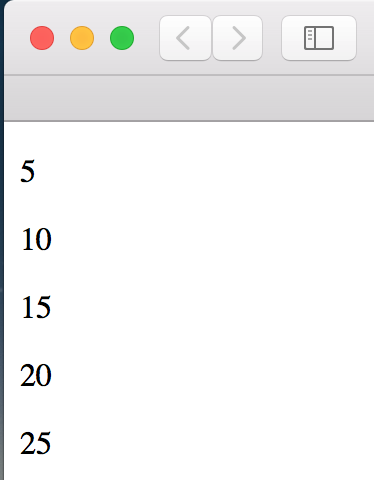

今天想說用 Go.js 寫視覺化，但卻有水印。雖然 D3.js 沒辦法在文章中寫入，但寫成普通網頁卻很簡單，而且文章也很多，所以就用 D3.js 。

<!-- more -->

```html
<!DOCTYPE html>
<html lang="en">
<head>
  <meta charset="UTF-8">
  <meta name="viewport" content="width=device-width, initial-scale=1.0">
  <meta http-equiv="X-UA-Compatible" content="ie=edge">
  <title>Document</title>
  <script type="text/javascript" src="https://d3js.org/d3.v4.min.js"></script>
</head>
<body>
  <script>
    var dataset = [5, 10, 15, 20, 25];

    d3.select("body").selectAll("p")
        .data(dataset)
        .enter()
        .append("p")
        .text(function(d) { return d;});
  </script>
</body>
</html>
```



截圖有點不方便（還要調整大小，而且要用 html 標籤）。