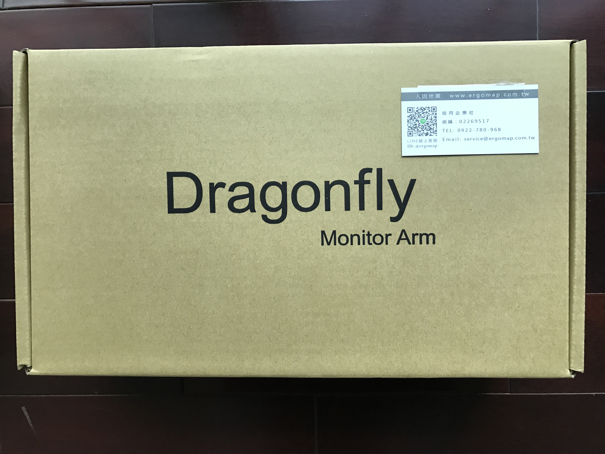
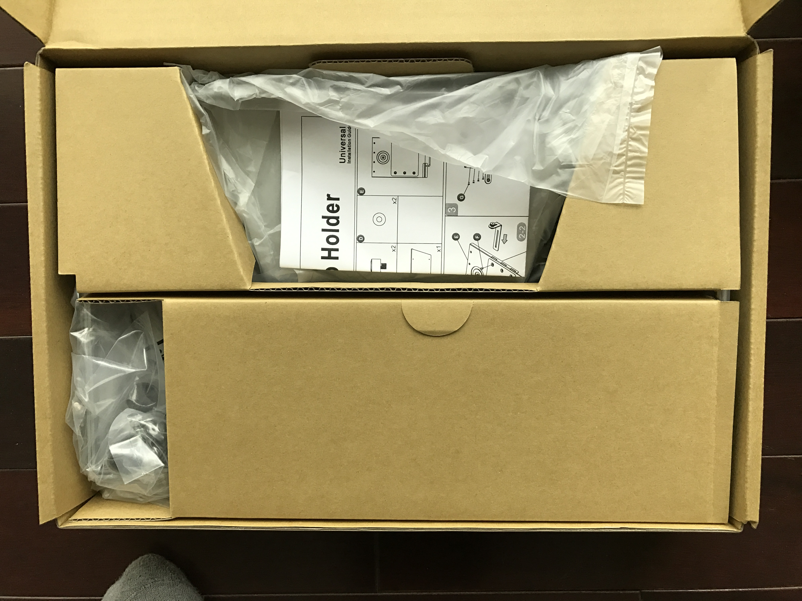
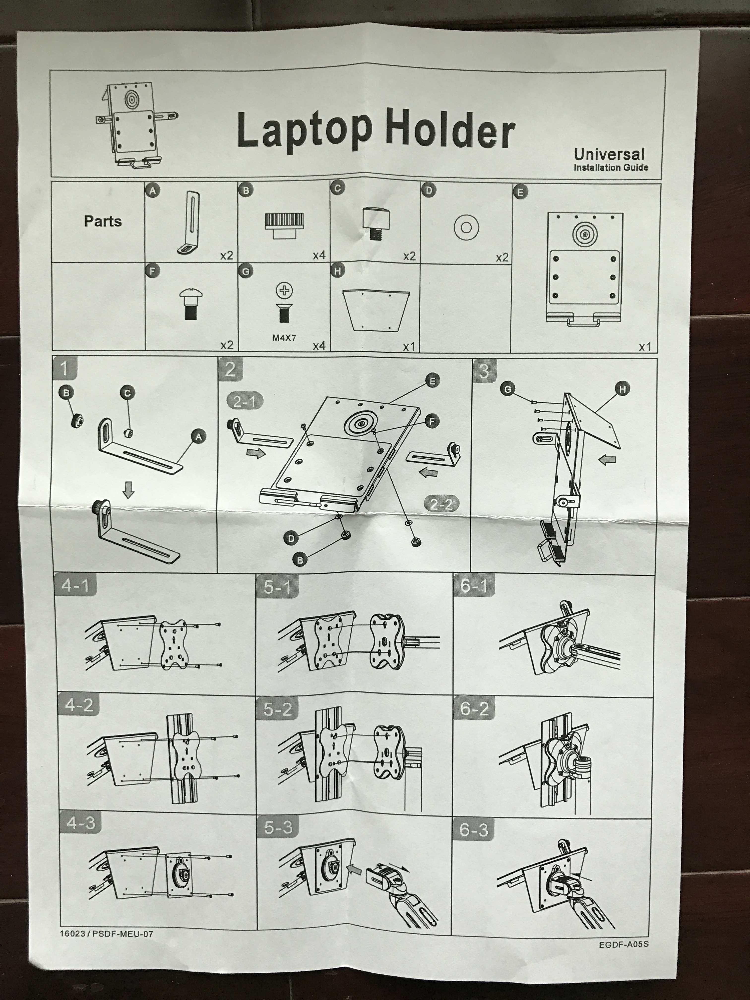
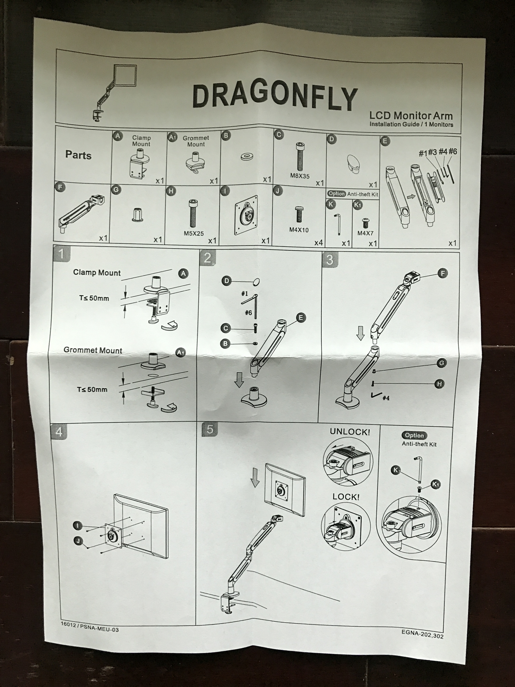
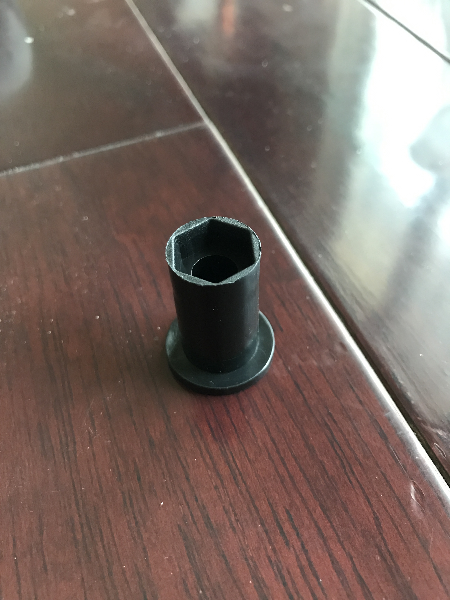
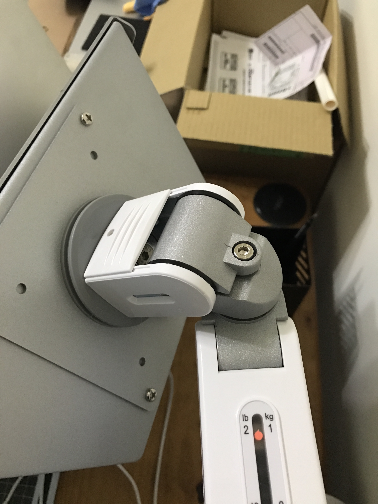
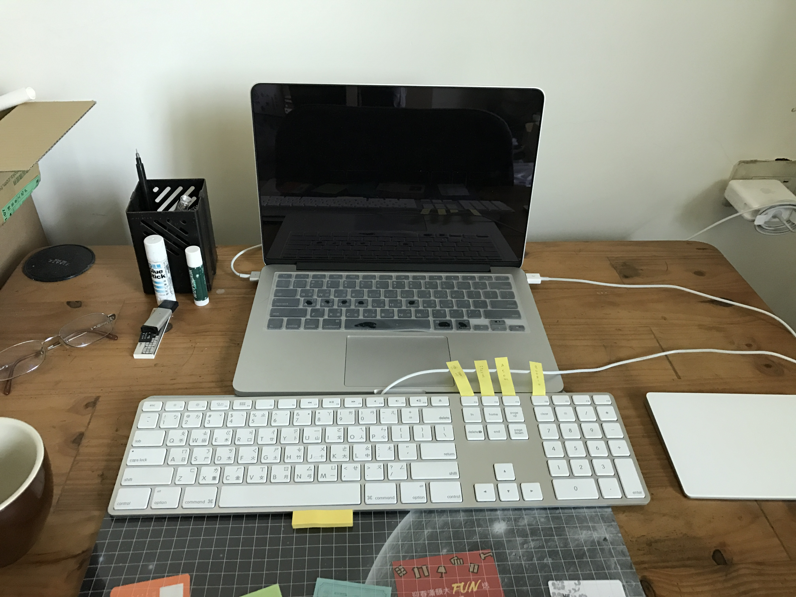
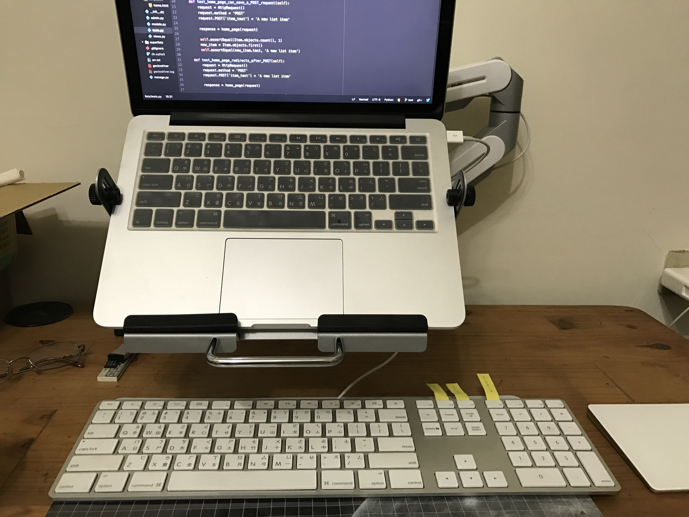
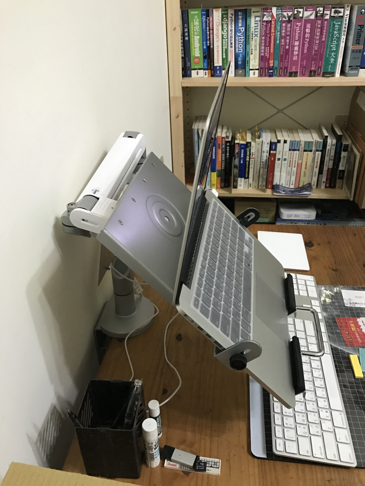

## 開箱

三月十號買的筆電架在中午左右終於送到了，真的超重的XDDD
買的是 [ErgoMap人因地圖](http://www.ergomap.com.tw/index.php?route=common/home) 的 [漂浮式 桌用人體工學筆電架](http://www.ergomap.com.tw/EGA05) 如下圖：

上面這一盒內是支架（這一盒因為有底座所以最重），但不加上筆電托盤部份。

<!--more-->

這一盒就是托盤，打開如下：

最底下就是托盤，打開盒子說明書就在眼前XDD

整面都是英文（還好好少零件）

這裡有幾點要先注意：

* 筆電先放在托盤上，確定哪一個位置放 A 零件上去時不會擋到筆電插口。
* 托盤最下面有兩個塑膠墊先確任是否牢固，我的塑膠墊右邊沒放好掉出來 XDD
* 由於托盤下面是金屬，所以請小心輕放。

另外一個就是支架說明書：

看圖， A 零件就是盒子內最重的底座， E 零件是下端支撐臂，在安裝時不知道為什麼掉出了下圖零件：

最後在鎖下支撐臂到底座時因為鬆鬆搖來搖去，才知道要放在說明書 2 步驟中的 B 零件下方。

其他部分就照著說明書安裝就可以了，但在安裝筆電托盤時也有幾點要注意：

* 當托盤放在支架時，如果托盤在「低頭」請不要緊張，把下圖看到的六角螺絲順時鐘鎖緊（記得把托盤調到要的高度），而且要鎖很緊才行，要不然筆電放上去托盤和筆電又要低頭了XDD

* 托盤和支架連接的部份用扣榫就可以了，我開箱時找螺絲找老半天，原來沒有附XDD

最後放上安裝前和安裝後的照片：

上面是安裝前，我覺得筆電離我超遠的，每次都彎腰駝背的。

上面這一張圖就可以看到筆電的位置比較高了，而且可以拉到更前面。

上面是側面照。

## 結語

當初買支架是因為想換一個大螢幕外接來寫程式，在網路上找到 [ErgoMap人因地圖](http://www.ergomap.com.tw/index.php?route=common/home) 的 [漂浮式 桌用人體工學筆電架](http://www.ergomap.com.tw/EGA05) ，就花錢買了（想說可以換接螢幕），目前還算 ok ，可能之後會換接螢幕XDD